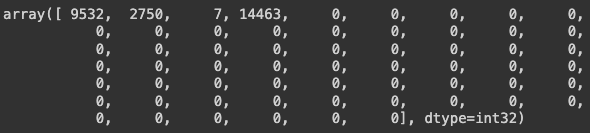
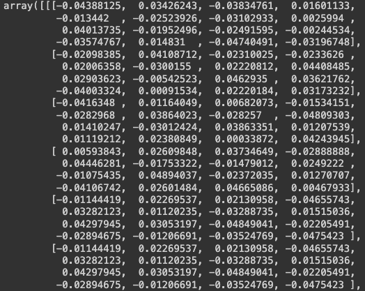

# Financial Sentiment Analysis 

#### *Created by Andrew McLaughlin and Jack Hastings*

## Introduction 
Our project is a sentiment analysis tool for financial news headlines. 
 - Multiple datasets were combined to train a neural network ML model.
 - New financial news headlines are then retrieved by calling the Finnhub API using user inputs. 
 - This new data is pre-processed and then analysed by the model.
 - Users can explore the analysis and then input a range of ticker symbols and dates to explore the tool further.

## Contents of Repository
 - `README.md`: Overview of the project, setup instructions, and usage.

 - `requirements.txt`: A text file listing the dependencies required to run this project.
 - `app.py`: The Flask application script that runs the web server and handles all routing for the website.
 
  - `static/`: This directory contains the style.css file 

- `templates/`: This directory contains the HTML templates that are rendered by Flask.
  - `index.html`: The homepage template that displays the user interface for input.
  - `result.html`: The template for displaying sentiment analysis results after a user query.
  - `market_news.html`: The template for showing general market news sentiment results.
  - `no_data.html`: The template displayed when no data is available for the user's query.
- `images`: Folder containing images for the README 
- `.gitignore`: A text file specifying intentionally untracked files that Git should ignore.
- `Resources`: This folder contains the
- `cleaned_data`: This directory contains the file combined.csv which contains the data used to train and validate the NN
- `guardian_negative`: Contains code and data involved in creating combined.csv (please refer to the section below on cleaning on more information about this folder).
- `original_data`: contains all original data sets used to created combined.csv
- `Neural_Network`: Jupyter notebook that contains code used to train, validate and save the neutral network along with the creation of tokenizer.json used in app.py
- `Pre-processing`: Jupyter notebook that contains code used to clean the data sets from the directory original_data
- `database.py`: Code to create the sqlite database contain in the Resources directory
- `eda.ipynb`: Jupyter notebook that contains code used to perform basic exploratory data analysis on combined.csv
- `saved_model.h5`: The model that was saved in Neural_Network.ipynb and used in app.py
- `tokenizer.json`: Json file containing word_index dictionary used in app.py for prediction in conjunction with saved_model.h5


## Cleaning and EDA

### Cleaning

In the folder “original_data” there are 6 csv’s containing most of the data used in this project. The following lists the name of the csv file and its source,

-	`companies_1.csv` - [link](https://www.kaggle.com/datasets/sbhatti/financial-sentiment-analysis/data) 
-	`SEntFiN-v1.1.csv` - [link](https://www.kaggle.com/datasets/ankurzing/aspect-based-sentiment-analysis-for-financial-news) 
-	`phrasebook.csv` - [link](https://huggingface.co/datasets/financial_phrasebank) 
-	`stock_news.csv` - [link](https://www.kaggle.com/datasets/johoetter/labeled-stock-news-headlines) 
-	`sent_train.csv and sent_valid.csv` - [link](https://huggingface.co/datasets/zeroshot/twitter-financial-news-sentiment/viewer/default/train) 

There is also an excel file called negative_guardian.xlsx which was the result of manually searching through negative_guardian.csv (located in the folder guardian_negative) in excel and removing headlines that were not negative. The file negative_guardian.csv itself was created from the notebook guardian_negative.ipynb using the csv guardian_headlines.csv (both located in the folder guardian_negative). The way that negative_guardian.xlsx was created can be seen in the notebook but was determined to be a slow and ineffective way of creating our own data set and so was abandoned, however about 2500 negative headlines were found through this method and were used to train and validate the neural network. 

The original data set containing guardian_headlines.csv can be found [here](https://www.kaggle.com/datasets/notlucasp/financial-news-headlines).

The excel file words.xlsx, which contains a list of negative and positive words can be found [here](https://www.cs.uic.edu/~liub/FBS/sentiment-analysis.html).

In the notebook Pre-processing.ipynb, these 7 data sets were combined and cleaned. Cleaning involved removal of URLs, removal of irrelevant strings such as “UPDATE –” and “Politics live with Andrew Sparrow” along with non-alphanumeric characters such as commas, apostrophes etc. The reason we removed non-alphanumeric characters was that the tokenizer (spoken about in the next section in more depth) used to create the neural network would treat two strings for example ‘meltdown’ and meltdown as two different tokens because of the apostrophes, however, we wanted all occurrences of the same word to seen as the same word by the NN. We also removed strings such as “US” and “UK” since they occurred frequently, and it was a possibility that the NN would associate them more heavily with either negative or positive sentiments depending on the training data, i.e., if there were particular strings such as the ones mentioned above that occurred more in negative headlines, then the NN would be biased towards classifying them as negative, especially if the NN was not familiar with the other words in the input string. 

### EDA

The file combined.csv, located in cleaned_data, contains headlines labelled as 0 (negative), 1 (neutral) and 2 (positive), however, it was determind that the neutral headlines would not be used since combined.csv is the combination of 7 separate data sets where the definition of neutral varies between data set. Please refer to `eda.ipynb` for a greater explanation of why we made this choice. Another problem we ran into was a massive class imbalance between the number of positive and negative headlines. This was dealt with by using undersampling in `Neural_Network.ipynb`. 

## The Neural Network

The neutral network used for the webpage, located in first_nn.ipynb, is a binary classification model that attempts to classify headlines as either negative (output between 0 and 0.5) and positive (output between 0.5 and 1). It utilises tensorflow's inbuilt tokenizer and embedding layer along with GlobalAveragePooling1D(). Tokenizing is simply the mapping of words in each headline to a unique integer, for example, the sentence "asx crashes and burns" is mapped to, [9532, 2750, 7, 14463]. It is also necessary that each list of tokenized words is of the same length when fed into the embedding layer, therefore, each list is padded with zeros giving each array a length of 60,

<p align="center"></p> 

It was determined that there are fewer than 60 words in each headline in both the training and testing sets and that generally speaking headlines fall well short of a word count of 60. Finally, each entry of the padded array is mapped to a unique point in a 16 dimensional space (16 dimensions was decided upon from trial and error, but decreasing/increasing the number of dimensions seemed to have little impact on the performance of the model). For example, the padded array from above is mapped to an array of arrays of size 60 by 16, 

<p align="center"></p> 

The output of the embedding layer is then fed into the GlobalAveragePooling1D() layer which simply averages the arrays/vectors to produce a single 16 dimensional vector which is then fed into a hidden layer consisting of 15 neurons. Since we are doing binary classication on the headlines, the output layer consists of a single neuron with a sigmoid activation function. The structure of the NN was decided through trial and error, other models as LSTMs and GRUs were considered and implemented however did not improve performance. 

## The Webpage

Our Financial News Sentiment Analysis webpage serves as an interactive platform for users to evaluate the sentiment of financial news headlines. Leveraging a machine learning model, it analyses and interprets the sentiment of financial news related to specific ticker codes, companies, or markets within a user-defined date range. The webpage is developed using:

- `Flask`
- `HTML`
- `CSS`
- `Python`
- `JavaScript`

### Features

The webpage offers the following key functionalities:

1. `Ticker Sentiment Analysis`: Users can search for financial news headlines related to a specific ticker/company code and receive a sentiment analysis for the chosen date range. It includes an aggregated sentiment across all returned headlines for the chosen date period, as well as individual sentiment for each news article. 

2. `General News Sentiment`: The platform allows users to query financial news categories such as "General," "Forex," "Crypto," and "Merger" and receive sentiment analysis for each headline.

3. `Report & Improve`: A "Report" feature enables users to flag incorrect sentiments, storing the correct headline and sentiment in a SQLite database for future model refinement.

*screenshot of the tool's homepage* 


---

## Instructions on Running the Webpage

#### Prerequisites

Ensure you have the following before running the webpage on your local machine:

- Python (version 3.10.11 was used for this project).
- Create your own free API key from [Finnhub](https://finnhub.io/) to fetch financial news.

#### Installation Steps

1. Clone the repository to your local machine:

```
git clone https://github.com/JackHast/project_4.git
```

2. Navigate to the project directory:

```
cd project_4
```

3. Install the required Python dependencies.
```
pip install -r requirements.txt
```

#### Configuration

1. Rename config.example.json to config.json.
1. Replace `"enter_your_api_key_here"` with your own Finnhub API key.

### Running the Webpage Locally

To start the webpage on your local environment, follow these steps:

1. Activate your virtual environment if using one.
2. Run `python app.py`. 
3. Access the application via a web browser at `http://127.0.0.1:5000/` or `http://localhost:5000/`.
4. Use the web interface to perform sentiment analysis by entering a ticker code and selecting a date range.

---

## Acknowledgements 
